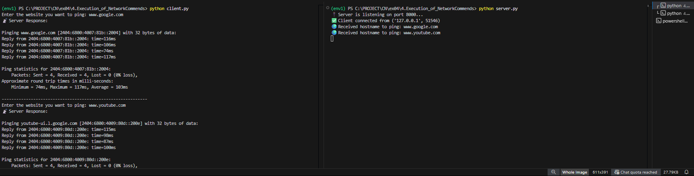
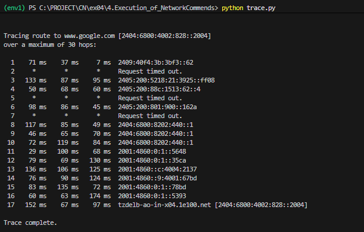

# 4. Execution of Network Commands

## AIM  
Use of network commands in a real-time environment.

## Software  
- Command Prompt  
- Network Protocol Analyzer

## Procedure  
To do this experiment, follow these steps:

Students have to understand basic networking commands such as:

- `tcpdump`
- `netstat`
- `ifconfig`
- `nslookup`
- `traceroute`

Additionally, capture **ping** and **traceroute** PDUs using a **network protocol analyzer**.

This includes all commands related to **network configuration**, such as:

- Switching to **privileged mode** and **normal mode**
- Configuring **router interfaces**
- Saving the configuration to **flash memory** or **permanent memory**

### This includes the following commands:

- Configuring the router commands  
- General commands to configure network  
- Privileged mode commands of a router  
- Router processes & statistics  
- IP commands  
- Other IP commands (e.g., `show ip route`)

---
## PROGRAM 
## server.py

```python
import socket
import os

s = socket.socket()
s.bind(('localhost', 8000))
s.listen(5)

print("🔌 Server is listening on port 8000...")

c, addr = s.accept()
print(f"Client connected from {addr}")

while True:
    hostname = c.recv(1024).decode()
    print(f"Received hostname to ping: {hostname}")

    try:
      
        result = os.popen(f"ping -n 4 {hostname}").read()
        c.send(result.encode())

    except Exception as e:
        c.send(f"Ping failed: {str(e)}".encode())
```

## client.py
```python
import socket

s = socket.socket()
s.connect(('localhost', 8000))

while True:
    ip = input("Enter the website you want to ping: ")
    s.send(ip.encode())

    response = s.recv(4096).decode()
    print("Server Response:\n", response)
    print("-" * 60)
```

## trace.py

```python
import os

website = input("Enter the website to traceroute: ")
result = os.popen(f"tracert {website}").read()

print("\nTraceroute Result:\n")
print(result)
```

## Output

### CLIENT AND SERVER :


### TRACE :



## Result
Thus Execution of Network commands Performed 
